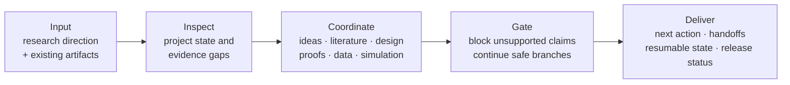

# Research Paper Workflow

[](https://github.com/XuQingAcademic/research-paper-workflow/actions/workflows/ci.yml)
[](https://github.com/XuQingAcademic/research-paper-workflow/tags)
[](LICENSE)

[简体中文](README.zh-CN.md) · [Changelog](CHANGELOG.md) ·
[Security](SECURITY.md) · [Privacy](PRIVACY.md) ·
[Compatibility](docs/COMPATIBILITY.md) ·
[State schemas](docs/STATE_SCHEMAS.md) ·
[CLI exit codes](docs/EXIT_CODES.md) ·
[Third-party provenance](THIRD_PARTY.md)

Turn a research direction into an auditable quantitative-paper workflow without
losing literature evidence, proof gaps, simulation state, or revision history.

Research Paper Workflow is an evidence-grounded Agent Plugin for econometrics,
statistics, and quantitative economics. It coordinates idea discovery,
literature, research design, proofs, empirical evidence, simulation, writing,
independent review, revision, and reproducible delivery while keeping every
scientific claim bounded by the evidence that actually exists.

> **Status: v0.1.0 Research Preview.** The bundled controllers have local
> regression coverage, but this release is not a guarantee of novelty,
> mathematical correctness, identification, publication, or exhaustive
> literature coverage. See [claim boundaries](docs/CLAIMS.md).

## Install and start

Add the GitHub marketplace and install the plugin:

```bash
codex plugin marketplace add XuQingAcademic/research-paper-workflow
codex plugin add research-paper-workflow@research-paper-workflows
```

Start a new Codex thread in a quantitative-research project and paste:

```text
Use $research-paper-workflow to inspect the current project, identify the next
unmet evidence requirement, and continue every branch that is safe to advance.
```

Optional verification:

```bash
codex plugin list
```

The output should include
`research-paper-workflow@research-paper-workflows` as installed and enabled.

## 60-second tour: input → process → deliverables



| Moment | What the user supplies | What the workflow does | What becomes inspectable |
| --- | --- | --- | --- |
| 0–15 s | A question, project brief, or existing paper | Classifies the project provisionally and reads current artifacts | The first unresolved evidence requirement |
| 15–40 s | Existing literature, proofs, code, and results if available | Routes only to installed specialist capabilities and preserves missing dependencies | Candidate routes, blockers, and bounded next actions |
| 40–60 s | No additional input is required for safe setup work | Records resumable state and prevents result-dependent claims from moving early | `.paper/workflow/plan.json`, stage status, and explicit pending gates |

Try the synthetic, privacy-safe example in
[`examples/minimal-paper`](examples/minimal-paper/README.md), or run its
deterministic controller smoke path:

```bash
python3 scripts/smoke_example.py
```

The smoke path initializes a methods-paper workflow, records simulation as
deferred, identifies `framing` as the next runnable stage, and makes no
scientific-result claim. See the full [quick-start walkthrough](docs/QUICKSTART.md).

## Why this project exists

Research agents often fail between specialist tasks: an idea loses its nearest
neighbor evidence, a proof gap does not propagate to the manuscript, a pilot is
reported as a production result, or a long simulation is polled repeatedly while
result-dependent prose keeps moving. This workflow makes those handoffs explicit.

Core mechanisms include:

- candidate portfolios, falsifiers, search frontiers, and reopen conditions;
- hash-bound stage receipts without creating a second scientific truth store;
- proof, empirical, simulation, and writing capability handoffs;
- a layered proof-genealogy framework and hash-bound active-lineage adapter without bundled proof content;
- paired non-regression evidence for material revisions;
- append-only operational telemetry and resumable state;
- handle-bound waits for offline jobs while independent work continues;
- release checks that distinguish structural success from scientific validity.

## Package layout

```text
.
├── .agents/plugins/marketplace.json       # repo-local marketplace
├── plugins/research-paper-workflow/       # installable portable plugin
│   ├── plugin.json                        # portable Agent Plugins manifest
│   ├── .codex-plugin/plugin.json          # Codex compatibility metadata
│   ├── controllers.json                   # CLI/library and exit-code inventory
│   ├── schemas.json                       # state-format lifecycle inventory
│   ├── dependencies/skills.json           # companion capability inventory
│   └── skills/research-paper-workflow/    # skill, references, scripts, tests
├── examples/minimal-paper/                # synthetic public example
├── scripts/                               # repository validation
└── docs/                                  # architecture and release contracts
```

The layout follows the current OpenAI Agent Plugins structure: a plugin has a
root `plugin.json` and discovers skills under `skills/`; the compatibility
manifest remains for Codex clients that still use it.

## Alternative local installation

Requirements:

- Codex or ChatGPT desktop with local plugin support;
- Python 3.9 or newer;
- macOS or Linux for the v0.1.0 controller scripts.

For local development, clone the repository, add that checkout as a marketplace,
then install the plugin:

```bash
git clone https://github.com/XuQingAcademic/research-paper-workflow.git
cd research-paper-workflow
codex plugin marketplace add "$PWD"
codex plugin add research-paper-workflow@research-paper-workflows
```

Restart the desktop app or start a new Codex session after installation. The
repo marketplace is defined in `.agents/plugins/marketplace.json`.

For development without installation, point Codex at
`plugins/research-paper-workflow` as a plugin capability directory.

## Additional usage paths

Open a quantitative-research project and ask:

```text
Use $research-paper-workflow to inspect the current project, identify the next
unmet evidence requirement, and continue every branch that is safe to advance.
```

For a synthetic project with no private data, start from
[`examples/minimal-paper`](examples/minimal-paper/README.md).
The runnable [`offline-wait example`](examples/offline-wait/README.md) shows why
result-dependent work pauses on a registered handle while unrelated work may
continue.

The workflow discovers companion skills at runtime. Missing providers do not
silently become successful stages: the workflow continues only unaffected work,
reports the missing capability, and narrows its claims. See
[dependency resolution](docs/DEPENDENCIES.md).

Inspect companion availability without changing the environment:

```bash
python3 plugins/research-paper-workflow/scripts/check_companions.py
```

The report deliberately labels scientific validation as “not assessed.” See
[Bundled controllers](docs/CONTROLLERS.md) for the public CLI and library
entrypoints and their evidence ceilings. Machine record names, compatibility,
and migration rules are indexed in [State schemas](docs/STATE_SCHEMAS.md).

## Development and verification

Run the complete local check:

```bash
python3 scripts/run_checks.py
```

This validates public-release hygiene and manifests, checks internal Markdown
links, compiles Python sources, runs the bundled workflow and repository tests,
and exercises the synthetic quick start in an isolated temporary project.

Build the standalone plugin archive with:

```bash
python3 scripts/package_plugin.py
```

The archive is deterministic for a fixed source tree and is written under
`dist/`, which is excluded from version control. Packaging also writes a
sidecar `.sha256` checksum for release verification. The archive itself contains
`MANIFEST.sha256`, which binds every packaged file except the manifest itself.
The build self-verifies. A downloaded candidate can be checked portably with:

```bash
python3 scripts/verify_release.py dist/research-paper-workflow-0.1.0.zip
```

GitHub Actions runs the same check on Linux and macOS across supported Python
versions. Windows is not claimed in v0.1.0 because several controllers use
POSIX file locks; contributions that add an equivalent tested lock backend are
welcome.

Current local evidence covers Python 3.9.6 and 3.12.14 on macOS. Configured but
unrun CI combinations remain pending in the [compatibility matrix](docs/COMPATIBILITY.md).

## Privacy and public/private separation

This repository intentionally excludes:

- unpublished manuscript excerpts and private evaluation cases;
- private mentor corpora, profiles, memory, or communications;
- project-local `.paper/` and supervision state;
- API keys, credentials, personal absolute paths, and raw research data.

Public examples must be synthetic, openly licensed, or contributor-owned and
explicitly cleared for redistribution. See [Security](SECURITY.md) and
[Contributing](CONTRIBUTING.md).

## Third-party skills

Yes—skills and public projects that materially support or influence the workflow
should be named. This repository records runtime integrations, pinned inspected
revisions, licenses, design influences, and whether code is bundled in
[THIRD_PARTY.md](THIRD_PARTY.md). The short rule is:

- interoperability: name the provider and version;
- design influence: cite the source and the adopted mechanism;
- copied or modified implementation: also preserve all required license notices.

No third-party skill implementation is bundled in v0.1.0.
CI-only GitHub Actions are also attributed separately in
`.github/actions-dependencies.json`; they are development infrastructure, not
runtime research capabilities.

## Contributing

Read [CONTRIBUTING.md](CONTRIBUTING.md). Behavioral changes should include tests
for the changed invariant, and scientific claims must state the exact evidence
scope. Please report vulnerabilities privately as described in
[SECURITY.md](SECURITY.md).

## Citation and license

This is a software project and does not require a companion paper. Software
citation metadata is in [CITATION.cff](CITATION.cff); the maintainer's public
contact email is included, while ORCID remains optional and omitted. References,
runtime integrations, and GitHub projects used or consulted are attributed in
[THIRD_PARTY.md](THIRD_PARTY.md). The project is released under the
[MIT License](LICENSE). See [Privacy](PRIVACY.md) and [Terms](TERMS.md).
Third-party projects retain their own licenses.
